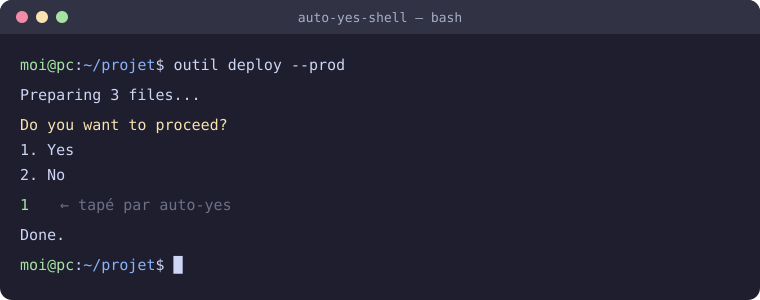

<p align="center">
  
</p>

# auto-yes — 自動對確認請求回答「1」

[](https://github.com/AntiCitoyen/Anticitoyen-auto-yes/releases/latest)
[](https://github.com/AntiCitoyen/Anticitoyen-auto-yes/actions/workflows/ci.yml)
[](../../LICENSE)
[](https://buymeacoffee.com/anticitoyen)

在 Linux 終端機中，**auto-yes** 會監看程式顯示的內容，一旦出現可辨識的確認選單（預設為「Do you want to proceed?」接著「1. Yes」），就會代替您輸入 **1** 然後按下 Enter。終端機仍保持完全互動：打字、Ctrl-C、調整大小、顏色。

<div align="center">

[🇫🇷 Français](../../README.md) · [🇬🇧 English](README.en.md) · [🇪🇸 Español](README.es.md) · [🇩🇪 Deutsch](README.de.md) · [🇮🇹 Italiano](README.it.md) · [🇧🇷 Português](README.pt-BR.md) · [🇳🇱 Nederlands](README.nl.md) · [🇵🇱 Polski](README.pl.md) · [🇷🇺 Русский](README.ru.md) · [🇺🇦 Українська](README.uk.md) · [🇹🇷 Türkçe](README.tr.md) · [🇸🇦 العربية](README.ar.md) · [🇮🇳 हिन्दी](README.hi.md) · [🇨🇳 简体中文](README.zh-CN.md) · **🇹🇼 繁體中文** · [🇯🇵 日本語](README.ja.md) · [🇰🇷 한국어](README.ko.md) · [🇻🇳 Tiếng Việt](README.vi.md) · [🇮🇩 Bahasa Indonesia](README.id.md)

</div>

<p align="center"><br><em>選單出現，auto-yes 回答「1」，指令繼續執行。</em></p>

> ⚠️ **請在了解風險的情況下使用。** auto-yes 會確認任何符合已設定樣式的請求，包括破壞性指令（移除套件、磁碟工具）或請求您同意的其他程式。請保持樣式的範圍狹窄。

---

## 目錄

- [專案功能](#projet)
- [安裝](#installation)
- [使用方式](#utilisation)
- [樣式](#motifs)
- [運作原理](#fonctionnement)
- [疑難排解](#depannage)
- [儲存庫結構](#depot)
- [建置套件](#deb)
- [授權](#licence)
- [支持本專案](#soutien)

---

<a id="projet"></a>

## 專案功能

| 指令 | 作用 |
|---|---|
| `auto-yes <指令> [參數…]` | 啟動**一個**指令並回答它的確認請求 |
| `auto-yes-shell` | 取代登入 shell：在該終端機中輸入的**所有**指令都會受益，無需前綴 |
| `auto-yes-configurer-gnome-terminal` | 將 `auto-yes-shell` 掛接到預設的 GNOME Terminal 設定檔上（`--revert` 可還原） |
| `auto-yes --pause` / `--reprise` | 在**所有**終端機（即使是已經開啟的）中暫停 / 恢復自動回應 |
| `auto-yes --etat` / `--journal [N]` | 目前狀態；最近記錄的 N 次回應 |

- **終端機保持原樣**：使用 Expect 的 `spawn` + `interact`；您輸入的一切都會正常傳遞，只有樣式匹配時才會觸發傳送。
- **畫面靜止**：僅當選單出現後 300 毫秒內沒有新內容顯示時才會送出回應；捲動文字中引用的問題會被忽略。
- **日誌**：每個被辨識的樣式都會被記錄（日期、回應或棄權原因、前景程式、文字）到 `~/.local/state/auto-yes/journal.log`。
- **視窗大小變化被轉發**：當視窗改變大小時，shell 與程式都會知道（歷史紀錄編輯、`less`、`vim`、`htop` 保持正確）。
- **無需重新安裝即可修改樣式**：`/etc/auto-yes/patterns.conf`，每次開啟新終端機時重新讀取。
- **不會重複包裝**：已在 auto-yes 下執行的終端機再啟動另一個終端機時不會被二次包裝（`AUTO_YES_ACTIVE`）。

<a id="installation"></a>

## 安裝

### Debian / Ubuntu 套件

從[最新版本](https://github.com/AntiCitoyen/Anticitoyen-auto-yes/releases/latest)下載 `.deb` 檔案，然後：

```bash
sudo apt install ./auto-yes_*_all.deb
```

相依套件：`expect`（≥ 5.45）與 `procps`。

### Fedora、openSUSE…（RPM）與 Arch Linux

同一版本也提供 `auto-yes-<version>-1.noarch.rpm`（`sudo dnf install ./auto-yes-*.noarch.rpm`）、`.src.rpm`、Arch 套件（`sudo pacman -U auto-yes-*.pkg.tar.zst`）以及 AUR 檔案（`aur-<version>.tar.gz`：`PKGBUILD` 與 `.SRCINFO`）。

### 從原始碼建置

```bash
git clone https://github.com/AntiCitoyen/Anticitoyen-auto-yes.git
cd Anticitoyen-auto-yes
packaging/build-deb.sh
sudo apt install ./dist/auto-yes_*_all.deb
```

<a id="utilisation"></a>

## 使用方式

### 單一指令

```bash
auto-yes apt install 套件
auto-yes ./互動式指令碼.sh --選項
```

### 整個終端機

**建議方法 — `~/.bashrc`**（保留起始資料夾，例如透過檔案管理員的*在終端機中開啟*）；加到檔案結尾：

```bash
# 在每個互動式終端機中啟用 auto-yes（不重複包裝，排除非互動式 shell）
if [[ $- == *i* ]] && [ -z "$AUTO_YES_ACTIVE" ] && [ -x /usr/bin/auto-yes-shell ] \
   && [ "$(ps -o comm= -p "$PPID" 2>/dev/null)" != expect ]; then
  exec /usr/bin/auto-yes-shell
fi
```

**另一種方法 — GNOME Terminal 設定檔**（以您自己的身分執行，絕不使用 `sudo`）：

```bash
auto-yes-configurer-gnome-terminal           # 新視窗與分頁 → auto-yes-shell
auto-yes-configurer-gnome-terminal --revert  # 還原
```

此方法既不影響已開啟的終端機，也不影響 `gnome-terminal -- <指令>`，也不影響其他模擬器。

<a id="motifs"></a>

## 樣式

`/etc/auto-yes/patterns.conf`：每行一個 Tcl 正規表示式（`interact -re`）；空白行與以 `#` 開頭的行會被忽略。內建樣式：

```
(?i)do you want to proceed\??[^\n]*\n\s*1\.
```

它要求既有問句，**又**在下一行有編號選單的 `1.` 選項：單獨一句話（由 `cat`、`echo`、日誌顯示）不會觸發任何動作。

| 規則 | 原因 |
|---|---|
| 針對完整選單，而非孤立的句子 | 引用該句子的文字不應觸發回應 |
| 邊界請用 `\s` 或 `\y`，絕不用 `\b` | 在 Tcl 中，`\b` 是退格鍵，而不是單字邊界 |
| 開頭加 `(?i)` 以忽略大小寫 | 程式在「Proceed」/「proceed」之間各不相同 |
| 使用 `AUTO_YES_PATTERNS=檔案 auto-yes …` 進行測試 | 該變數會在測試時取代 `/etc/auto-yes/patterns.conf` |

### 環境變數

| 變數 | 用途 | 預設值 |
|---|---|---|
| `AUTO_YES_PATTERNS` | 樣式檔案 | `/etc/auto-yes/patterns.conf` |
| `AUTO_YES_CALME` | 選單出現後需保持安靜的時間，以毫秒為單位（`0`：立即回應） | `300` |
| `AUTO_YES_JOURNAL` | 日誌檔案（留空：不記錄任何內容） | `~/.local/state/auto-yes/journal.log` |
| `AUTO_YES_ETAT` | 狀態目錄（暫停旗標） | `~/.local/state/auto-yes` |

完整說明：`man auto-yes`。

<a id="fonctionnement"></a>

## 運作原理

1. `auto-yes-shell` 讀取樣式，設定 `AUTO_YES_ACTIVE=1`，然後在虛擬終端機中（`spawn -noecho`）啟動 `$SHELL -l`。
2. `interact -o -nobuffer -re <樣式>` 會複製您的終端機與 shell 之間的所有內容；當程式的輸出符合某個樣式時，auto-yes 會確認暫停未啟用且畫面已保持安靜 `AUTO_YES_CALME` 毫秒，接著送出 `1` 與 Enter，並將整個過程記錄到日誌中。
3. `trap … WINCH` 會將視窗大小（`stty rows/columns`）複製到 shell 的虛擬終端機，並向其傳送 `SIGWINCH`。

<a id="depannage"></a>

## 疑難排解

| 症狀 | 原因與解決方法 |
|---|---|
| 編輯以 ↑/↓ 叫出的指令時，該行會位移或消失 | ≤ 1.1 版本：視窗大小未被轉發，bash 一直停留在 80 欄。已在 1.2 中修正；更新後請開啟新終端機。`stty size` 應顯示實際大小。 |
| 沒有人請求卻出現了「1」 | 顯示的文字符合某個樣式，且畫面此後保持安靜（≤ 1.2 版本：沒有任何等待）。`auto-yes --journal` 會顯示是哪個程式與哪段文字；請縮小該樣式、提高 `AUTO_YES_CALME`，或在操作期間使用 `auto-yes --pause`。 |
| 什麼都沒有得到回應 | 用 `AUTO_YES_PATTERNS` 檢查樣式；由游標序列繪製的選單（沒有真正的換行符）不會匹配 `\n`。 |
| 終端機在根目錄而不是目前資料夾中開啟 | 「GNOME Terminal 設定檔」方法：請改用 `~/.bashrc` 方法。 |
| 真正的選單被辨識卻沒有被確認 | 該程式持續顯示內容（動畫、時鐘）：日誌會顯示 `ignoré:défilement`。請降低 `AUTO_YES_CALME`，或針對該程式設為 `0`。 |
| 隨時停用所有終端機 | `auto-yes --pause`（之後 `--reprise`）；或使用 `AUTO_YES_ACTIVE=1 bash` 開啟一個沒有 auto-yes 的 shell。 |

<a id="depot"></a>

## 儲存庫結構

| 路徑 | 內容 |
|---|---|
| `bin/auto-yes`、`bin/auto-yes-shell` | Expect 指令碼 |
| `bin/auto-yes-configurer-gnome-terminal` | 與 GNOME Terminal 設定檔的掛接 |
| `share/auto-yes/commun.tcl` | 共用程式碼：樣式、畫面靜止、日誌、暫停、視窗大小 |
| `man/` | `auto-yes(1)` 手冊頁 |
| `etc/patterns.conf` | 內建樣式（`/etc/auto-yes/patterns.conf`，設定檔在更新時會被保留） |
| `packaging/` | `install.sh`（共用）、`build-deb.sh`、`control`、`changelog`、`copyright`、套件指令碼；`rpm/auto-yes.spec`、`aur/PKGBUILD` |
| `tests/test_auto_yes.py` | 虛擬終端機測試：調整大小、辨識選單、忽略孤立句子與捲動文字、日誌、暫停 |
| `docs/readme/` | 本 README 的另外 18 種語言版本 |

<a id="deb"></a>

## 建置套件

```bash
python3 -m unittest discover -s tests -v   # 測試（需要 expect）
packaging/build-deb.sh                     # → dist/auto-yes_<版本>_all.deb
```

版本號來自 `packaging/changelog` 的第一行。每次發布新版本時，`.github/workflows/release.yml` 都會建置並附加 RPM、Arch 套件與 AUR 檔案。

<a id="licence"></a>

## 授權

[MIT](../../LICENSE)。

<a id="soutien"></a>

## 支持本專案

如果這個專案對您有幫助，一杯咖啡有助於維護它：

[](https://buymeacoffee.com/anticitoyen)

**https://buymeacoffee.com/anticitoyen**

錯誤回報與建議：[Issues](https://github.com/AntiCitoyen/Anticitoyen-auto-yes/issues)。安全漏洞：[SECURITY.md](../../SECURITY.md)。
